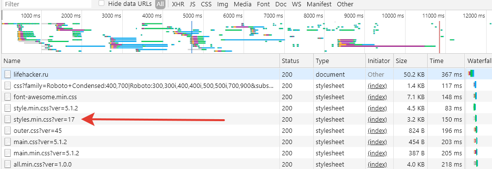
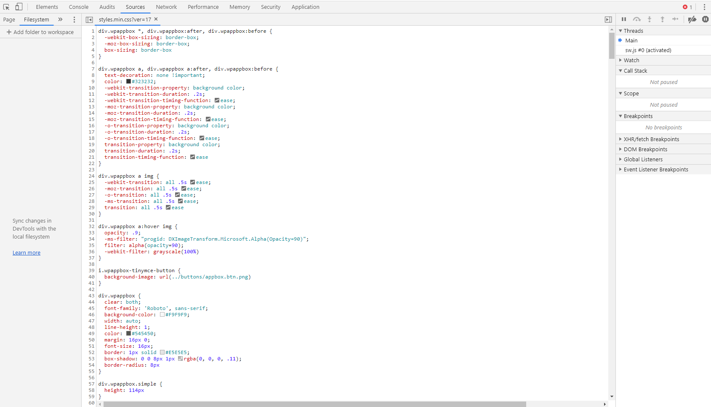
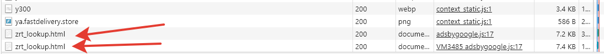
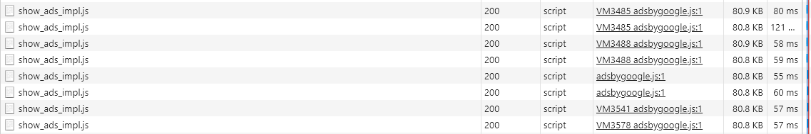
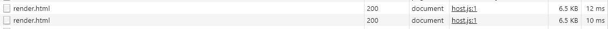
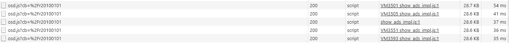
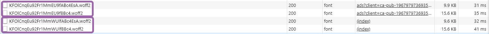
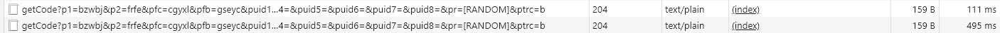
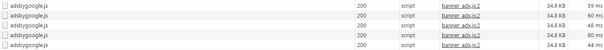
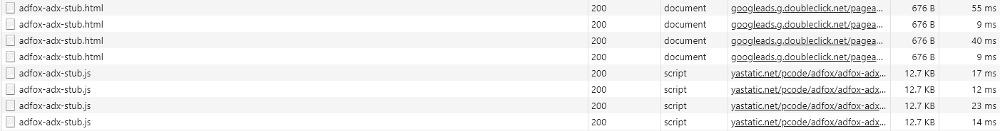

# Использование браузерных DevTools - анализ сайта

## Network

### На страницу загружается файл style.min.css?ver=17, однако при просмотре файла оказывается, что он не минифицирован.

*Файл в панеле Network*

*Файл в панеле Source*

### Дублированная загрузка файлов.

*zrt_lookup.html*

*show-ads-impl.js*

*render.html*

*osd.js*

*woff2*

*getCode*

*adsbygoogle.js*

*adfox-adx*
